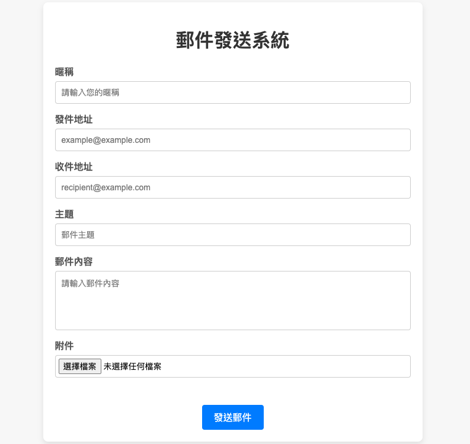

# Resend-Web-Email
基於Resend API的Web Email服務（Private）

## 功能

- 支援通過 Resend API 發送帶有附件的郵件
- 支援自定義郵件主題、發件人、收件人、郵件內容
- 支援文件上傳（最大 8MB）
- 支援從命令行獲取 API 金鑰來配置 Resend

## 預覽圖



## 預備條件

在開始之前，請確保你已經安裝了以下項目：

- [Node.js](https://nodejs.org/) (版本 18 或更高)
- [npm](https://www.npmjs.com/) (Node 包管理器)

## 安裝與配置

1. 克隆此項目到本地：

   ```bash
   git clone https://github.com/yourusername/email-sending-server.git
   cd email-sending-server
2. 安裝依賴項：

   ```bash
   npm install

3. 確保你擁有 Resend API 金鑰。如果沒有，請前往 Resend 註冊並獲取 API 金鑰。
4. 使用命令行參數配置 API 金鑰運行服務器：

   ```bash
   node server.js --api-key '<your-api-key>'
5. 注意：請將 <your-api-key> 替換為你從 Resend 獲得的 API 金鑰。

## API 端點

1. 發送郵件

   - URL: /send-email
   - 方法: POST
   - 內容類型: multipart/form-data
   
   ### 請求參數
   - nickname: 發件人暱稱
   - fromEmail: 發件人電子郵件地址
   - toEmail: 收件人電子郵件地址
   - subject: 郵件主題
   - textContent: 郵件正文內容（可選）
   - attachments: 附件檔案（可選，支持多個檔案）

2. 網頁界面
   
   URL: /
   方法: GET
   該端點提供一個簡單的 HTML 頁面，用戶可以在其中填寫郵件表單並發送郵件。靜態頁面 index.html 位於 public 目錄中。

## 常見錯誤

1. API 金鑰錯誤

   如果你沒有提供有效的 API 金鑰，服務器將顯示如下錯誤訊息：

   ```bash
   錯誤：API 金鑰是必需的。請使用 --api-key <key> 提供它。

2. 檔案大小超過限制

   如果上傳的檔案超過 8MB，服務器會返回以下錯誤訊息：

   ```bash
   {
     "message": "檔案大小不能超過 8MB"
   }


## 參與開發

- Fork 該項目並創建你自己的分支 (git checkout -b feature-branch).
- 提交你的修改 (git commit -am 'Add new feature').
- 推送到分支 (git push origin feature-branch).
- 創建 pull request。

## 註解

- 該項目使用了 Multer 來處理檔案上傳。
- 使用 Resend API 來發送郵件。
- 提供了一個簡單的 Web 界面來發送郵件，支持附件上傳。
- 當前僅提供 x64 架構的二進制文件，如需其他架構執行檔請參照package.json編譯。
